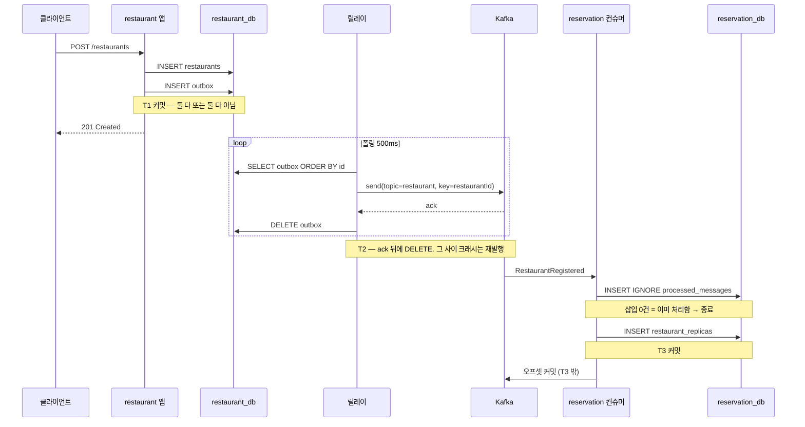
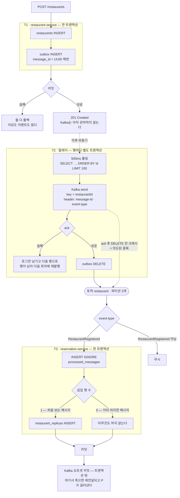

# 트랜잭셔널 아웃박스 구현 계획 (3장)

**대상 기능은 식당 등록 `POST /restaurants` 하나다.** 지금 이 기능은 MySQL에만 쓴다. 여기에 "식당이 등록됐다"는 사실을 Kafka로도 알려야 하는데, 그 순간 두 저장소에 나눠 쓰는 문제가 생긴다. 이 문서는 그 문제와 해법, 그리고 만들 순서를 담는다.

## 0. 한눈에 보기 — 무엇이 어디에 저장되고 어디로 나가는가

식당 하나를 등록하면 아래 6번의 쓰기가 순서대로 일어난다.

| # | 주체 | 대상 | 무엇을 |
|---|---|---|---|
| 1 | restaurant-service 애플리케이션 | `restaurant_db.restaurants` | 식당 본체 (`name`, `address`) |
| 2 | restaurant-service 애플리케이션 | `restaurant_db.outbox` | 발행할 메시지 — **1과 같은 트랜잭션** |
| 3 | restaurant-service 릴레이 | **Kafka 토픽 `restaurant`** | 아웃박스 행을 메시지로 변환해 발행 |
| 4 | restaurant-service 릴레이 | `restaurant_db.outbox` | 발행에 성공한 행을 DELETE |
| 5 | reservation-service 컨슈머 | `reservation_db.processed_messages` | 처리한 `message-id` 기록 |
| 6 | reservation-service 컨슈머 | `reservation_db.restaurant_replicas` | 식당 레플리카 — **5와 같은 트랜잭션** |

여기서 가장 중요한 사실 하나. **Kafka 발행(3번)은 등록 요청을 처리하는 도중에 일어나지 않는다.** 등록 API는 1·2번만 하고 201을 돌려주고 끝난다. 발행은 완전히 별개의 스레드인 릴레이가 나중에 한다. 그래서 **Kafka가 죽어 있어도 식당 등록은 정상 동작한다.**

인프라 전제는 다음과 같다.

- DB는 MySQL 8.4 단일 인스턴스에 `restaurant_db` · `reservation_db` · `payment_db`가 database 단위로 나뉘어 있고, 서비스마다 전용 계정으로 자기 database에만 접근한다 (ADR-006: 서비스별 DB). 스키마는 Flyway가 유일한 출처이며 `ddl-auto: none`이다.
- Kafka는 브로커 1대. 호스트에서는 `localhost:9092`, 컨테이너 안에서는 `kafka:19092`로 붙는다.

## 1. 무엇이 문제인가 — 이중 쓰기

`register()`가 식당을 저장하고 곧바로 Kafka에 발행하는, 가장 자연스러워 보이는 구현은 전부 깨진다.

| 시도 | 깨지는 지점 | 결과 |
|---|---|---|
| `restaurants` INSERT → Kafka 발행 | 저장 성공 후 발행 전 크래시 | 식당은 있는데 이벤트가 없다. **아무도 모르고 영원히 복구되지 않는다** |
| Kafka 발행 → `restaurants` INSERT | 발행 성공 후 저장 실패 | 존재하지 않는 식당의 이벤트. 컨슈머에 유령 레플리카가 생긴다 |
| 둘을 `@Transactional`로 감싸기 | 발행 후 롤백 | **Kafka는 DB 트랜잭션에 참여하지 않는다.** MySQL을 롤백해도 이미 나간 메시지는 회수 불가 |
| 2PC(XA)로 묶기 | — | 가용성이 참여자 가용성의 곱으로 떨어지고 Kafka가 표준 XA를 지원하지 않는다. 이 프로젝트는 2PC를 쓰지 않기로 이미 정했다 (ADR-005: IPC 스타일) |

해법은 문제를 뒤집는 것이다. **메시지를 Kafka가 아니라 자기 DB(`restaurant_db.outbox`)에 쓴다.** 그러면 식당 INSERT와 메시지 INSERT가 같은 MySQL 로컬 트랜잭션 안에 들어오고, 원자성은 InnoDB가 공짜로 준다. 실제 Kafka 발행은 나중에 릴레이가 별도로 한다.

대가가 하나 있다. 원자성을 얻는 대신 **"정확히 한 번"을 포기한다.** 릴레이가 발행에 성공하고 DELETE 하기 직전에 죽으면 재기동 후 같은 메시지를 다시 보내기 때문이다. 그래서 컨슈머 멱등은 선택 사항이 아니라 이 패턴의 필수 짝이다.

## 2. 어디에 무엇이 필요한가

세 지점에 손이 들어간다. 하나라도 빠지면 나머지 둘이 무의미해진다.

| 지점 | 무엇을 | 빠뜨리면 |
|---|---|---|
| restaurant-service `RestaurantService.register()` | `restaurants` INSERT와 `outbox` INSERT를 **한 트랜잭션**으로 묶는다 | 1절 표의 실패가 그대로 발생한다 |
| restaurant-service 릴레이 (신규) | `outbox`를 폴링해 Kafka로 발행하고 그 행을 지운다 | 메시지가 DB에 쌓이기만 하고 아무도 받지 못한다 |
| reservation-service 컨슈머 (신규) | 중복 검출과 레플리카 갱신을 **한 트랜잭션**으로 묶는다 | 재발행된 메시지가 레플리카를 오염시킨다 |

3장에서 DB 변경과 이벤트 발행이 함께 일어나는 곳은 `register()` 하나뿐이라 지금은 여기만 고치면 된다. 4장에서 사가가 들어오면 예약 생성·취소가 **같은 구조를 그대로 재사용**한다 — 그래서 지금 만드는 것은 식당 전용 장치가 아니라 이 서비스의 표준 발행 경로다.

## 3. 저장하는 것 — 스키마

### `restaurant_db.outbox` — 발행 대기 메시지

```sql
CREATE TABLE outbox
(
    id             BIGINT UNSIGNED NOT NULL AUTO_INCREMENT COMMENT '폴링 순서용 — 메시지에 실리지 않는다',
    message_id     CHAR(36)        NOT NULL COMMENT 'message-id 헤더로 나가는 UUID',
    aggregate_type VARCHAR(50)     NOT NULL COMMENT '토픽 결정 (Restaurant → restaurant)',
    aggregate_id   VARCHAR(50)     NOT NULL COMMENT '파티션 키 (restaurantId)',
    event_type     VARCHAR(100)    NOT NULL COMMENT 'event-type 헤더 (RestaurantRegistered)',
    payload        JSON            NOT NULL COMMENT '메시지 본문',
    created_at     DATETIME        NOT NULL DEFAULT CURRENT_TIMESTAMP COMMENT '진단용',
    PRIMARY KEY (id),
    UNIQUE KEY uk_outbox_message_id (message_id)
) ENGINE = InnoDB COMMENT = '발행 대기 메시지';
```

`id`와 `message_id`를 **따로 두는 이유**가 이 테이블의 핵심이다 (ADR-005: IPC 스타일).

- `id`(AUTO_INCREMENT)는 폴링 순서에만 쓰고 메시지에는 싣지 않는다. 서비스마다 1, 2, 3…이 독립적으로 매겨져 여러 서비스가 발행하기 시작하는 4장부터 컨슈머가 남의 메시지를 중복으로 오인한다.
- `message_id`(UUID)는 전역 유일하며 **INSERT 시점에 확정되고 이후 바뀌지 않는다.** 릴레이가 발행할 때마다 새로 만들면 크래시 후 재발행 시 ID가 달라져 컨슈머가 중복을 걸러내지 못한다.

### `reservation_db.processed_messages` — 중복 검출

```sql
CREATE TABLE processed_messages
(
    message_id   CHAR(36) NOT NULL COMMENT '처리 완료한 메시지 ID',
    processed_at DATETIME NOT NULL DEFAULT CURRENT_TIMESTAMP COMMENT '진단용',
    PRIMARY KEY (message_id)
) ENGINE = InnoDB COMMENT = '중복 검출 — 멱등 컨슈머';
```

PK 하나가 전부다. 판정은 **`INSERT IGNORE`가 반환하는 삽입 행 수**로 한다 — `1`이면 처음 보는 메시지, `0`이면 이미 처리한 메시지다.

```kotlin
@Modifying
@Query(
    value = "INSERT IGNORE INTO processed_messages (message_id) VALUES (:messageId)",
    nativeQuery = true,
)
fun insertIfAbsent(messageId: String): Int
```

**`JpaRepository.save()`를 쓰면 안 된다.** `message_id`는 `@GeneratedValue`가 없는 수동 할당 PK라 Spring Data의 `isNew()` 판정이 "신규 아님"으로 떨어지고, `save()`가 `persist()` 대신 `merge()`를 호출한다. `merge()`는 SELECT 후 UPDATE하는 upsert여서 **중복을 넣어도 제약 위반이 발생하지 않는다** — 중복 검출이 조용히 무력화된다.

별도 SELECT로 확인하고 INSERT 하는 방식도 안 된다. 두 컨슈머가 그 사이를 동시에 통과하는 창이 열린다. `INSERT IGNORE`는 유니크 인덱스가 판정하므로 이 창이 없다.

> `INSERT IGNORE`는 중복 키 외의 에러도 경고로 낮춘다. 이 테이블은 `CHAR(36)` PK와 기본값 타임스탬프뿐이라 실질적으로 걸릴 것이 없어 그대로 쓴다. 정밀하게 가리려면 `ON DUPLICATE KEY UPDATE message_id = message_id`로 바꾼다 — 반환값 규약(삽입 1 / 중복 0)은 같다.

### `reservation_db.restaurant_replicas` — 식당 레플리카

```sql
CREATE TABLE restaurant_replicas
(
    restaurant_id BIGINT UNSIGNED NOT NULL COMMENT 'restaurant-service가 채번한 ID — 여기서 채번하지 않는다',
    name          VARCHAR(100)    NOT NULL COMMENT '식당명',
    address       VARCHAR(255)    NOT NULL COMMENT '주소',
    PRIMARY KEY (restaurant_id)
) ENGINE = InnoDB COMMENT = '식당 레플리카 — 소유자는 restaurant-service';
```

`restaurants`가 아니라 `restaurant_replicas`로 이름 짓는다. 이 데이터의 **소유자가 이 서비스가 아니라는 사실을 이름이 말하게** 하기 위해서다. AUTO_INCREMENT가 없는 것도 같은 이유 — ID는 restaurant-service가 채번한 값을 그대로 받는다.

## 4. 발행하는 것 — 메시지

아웃박스 행 하나가 Kafka 메시지 하나로 변환된다.

```
토픽        restaurant                     ← aggregate_type "Restaurant"를 소문자로
파티션 키    "1"                            ← aggregate_id (restaurantId)
헤더        message-id: 550e8400-e29b-41d4-a716-446655440000
            event-type: RestaurantRegistered
본문        {"restaurantId":1,"name":"딥스식당 강남점","address":"서울 강남구 테헤란로 1"}
```

| 요소 | 값 | 왜 |
|---|---|---|
| 토픽 | `restaurant` | 애그리거트 타입 단위. 파티션 3개 |
| 파티션 키 | `restaurantId` | 같은 식당의 이벤트가 같은 파티션에 몰려야 한 컨슈머가 순서대로 본다 |
| `message-id` 헤더 | 아웃박스의 `message_id` | 컨슈머의 중복 검출 키. **발행 시점에 새로 만들지 않는다** |
| `event-type` 헤더 | 이벤트 타입명 | 컨슈머의 디스패치 키 |
| 포맷 | JSON | 사람이 읽을 수 있고 스키마 변경에 관대하다 |

본문에 `name`·`address`까지 싣는 이유는 **컨슈머가 되물어보지 않게** 하기 위해서다. 이름만 보내면 reservation-service가 restaurant-service로 동기 호출을 해야 하고, 그 순간 아웃박스로 지킨 가용성이 다시 깎인다.

이 계약의 정식 출처는 서비스 API 계약 문서다 (service-apis.md: 이벤트 — restaurant-service 발행). 구현이 여기서 벗어나면 계약 쪽이 아니라 구현이 틀린 것이다.

## 5. 처리 흐름

겉보기엔 하나로 이어진 것 같지만, 실제로는 **독립적으로 커밋되는 세 개의 트랜잭션**이다. 이 경계가 패턴의 전부다.



위 다이어그램이 정상 경로의 시간 순서를 보여준다면, 아래 순서도는 **어디서 갈라지고 어디서 실패하는지**를 보여준다.



세 지점만 짚어둔다. **`D`의 두 갈래**가 아웃박스의 존재 이유다 — "식당은 있는데 이벤트가 없는" 상태가 그림에 없다는 것 자체가 요점이다. **`H`에서 `L`로 가는 점선**이 중복이 태어나는 유일한 지점이고, 없애려 하지 않고 `P`가 흡수하게 했다. **`S`와 `U`가 나뉜 것**이 멱등이 필요한 이유 전부다 — DB 커밋과 오프셋 커밋은 원자적으로 묶을 수 없다.

### T1 — 등록과 기록 (restaurant-service, 한 트랜잭션)

1. `restaurants`에 식당을 저장한다.
2. 그 결과로 확정된 `restaurantId`로 아웃박스 행을 만들어 `outbox`에 저장한다.
3. 커밋.

순서가 이렇게 고정되는 이유는 `restaurantId`가 **페이로드와 파티션 키 양쪽에 들어가야** 하기 때문이다. `RestaurantJpaEntity`가 `GenerationType.IDENTITY`라 `save()` 시점에 INSERT가 즉시 실행되고 ID가 확정된다 — 별도 `flush()`는 필요 없다.

**보장**: 커밋되면 식당과 메시지가 둘 다 존재하고, 어디서 실패하든 둘 다 없다. 이 시점에 Kafka는 관여하지 않는다.

### T2 — 릴레이 (restaurant-service, 행마다 별도)

1. `SELECT * FROM outbox ORDER BY id LIMIT 100` — 커밋된 행만 보인다.
2. 행을 4절의 메시지로 변환한다.
3. 발행하고 **ack를 기다린다.**
4. 그 행을 `DELETE FROM outbox WHERE id = ?` 한다.

**3과 4의 순서는 뒤집을 수 없다.** DELETE를 먼저 하면 발행 실패 시 이벤트가 영구 유실된다. 지금 순서에서 최악의 경우는 "이미 보낸 걸 또 보냄"이고, 이건 T3가 흡수한다. 즉 **중복은 사고가 아니라 설계된 결과**다.

**행 단위로 예외를 잡고 다음 행으로 넘어간다.** 릴레이는 항상 미삭제 구간을 다시 읽으므로, 특정 행이 발행마다 실패하면(poison 행) 그 행이 DELETE되지 않아 다음 폴링에서도 맨 앞에 다시 잡힌다. 루프가 예외로 중단되는 구현이면 **그 뒤의 99개가 영원히 발행되지 못한다.** 3장에서는 실패한 행을 로그로 남기고 건너뛰는 수준까지만 한다 — 재시도 횟수 추적과 격리는 11장 관측성과 함께 다룬다.

발행한 행을 DELETE 하는 것도 결정 사항이다. `WHERE id > 마지막_발행_ID` 방식의 워터마크는 금지인데, AUTO_INCREMENT는 채번 순서와 커밋 순서가 달라서 — 트랜잭션 A가 `id=5`를 채번한 채 커밋 전인데 B가 `id=6`을 먼저 커밋하면 릴레이가 6을 읽고 워터마크를 올려 5를 영원히 놓친다 (ADR-005: IPC 스타일 — 워터마크 금지). 아웃박스는 영구 저장소가 아니라 임시 큐다.

순서 보장은 세 전제가 동시에 성립할 때만 유효하다.

| 전제 | 이유 | 깨지는 시점 |
|---|---|---|
| 릴레이 인스턴스 1개 | 여러 개면 같은 행을 동시에 읽어 중복 발행하고 순서가 무너진다 | 12장 X축 복제 → `SELECT ... FOR UPDATE SKIP LOCKED` 또는 리더 선출 |
| 파티션 키 = `aggregate_id` | 같은 식당의 이벤트가 같은 파티션에 몰려야 한 컨슈머가 순서대로 본다 | — |
| 프로듀서 `enable.idempotence=true` | 재시도가 메시지 순서를 뒤집지 않게 한다. Kafka 3.0+ 기본값이지만 명시한다 | 이 값을 끄고 `max.in.flight.requests.per.connection`을 올릴 때. 켠 채로 5를 넘기면 조용히 깨지는 게 아니라 프로듀서가 기동 시 `ConfigException`으로 거부한다 |

> **정직하게 남길 한계**: DELETE 방식은 위의 유실은 막지만 **순서 역전까지 막지는 못한다.** 늦게 커밋된 `id=5`는 다음 폴링에서 반드시 잡히되 `id=6`보다 나중에 발행된다. 같은 애그리거트에 동시 트랜잭션이 있을 때만 문제이고, 3장은 식당당 등록이 1회라 발생하지 않는다. 같은 애그리거트가 연속 변경되는 4장 이후에 재검토한다.

### T3 — 컨슈머 (reservation-service, 한 트랜잭션)

1. `message-id` 헤더를 읽는다.
2. `processed_messages`에 `INSERT IGNORE` — **삽입 행 수가 0이면 이미 처리한 메시지**이므로 그대로 종료한다.
3. `restaurant_replicas`에 레플리카를 저장한다.
4. 커밋.
5. Kafka 오프셋을 커밋한다. **트랜잭션 바깥이다.**

```kotlin
@Transactional
fun handle(messageId: String, event: RestaurantRegistered) {
    if (processedMessages.insertIfAbsent(messageId) == 0) return   // 이미 처리한 메시지
    replicas.save(RestaurantReplicaJpaEntity.from(event))
}
```

**2와 3이 같은 트랜잭션이어야 하는 이유**가 이 단계의 핵심이다. 나뉘면 "처리 기록은 남았는데 레플리카는 안 바뀐" 상태가 만들어지고, 그 메시지는 이후 영원히 중복으로 걸러져 **복구 경로가 사라진다.**

중복 판정을 예외가 아니라 반환값으로 하는 덕에 트랜잭션은 항상 정상 커밋된다. 제약 위반 예외로 판정하면 Hibernate 세션이 롤백 전용으로 표시되어 그 트랜잭션에서 더 진행할 수 없고, 예외를 잡는 지점이 트랜잭션 경계 안인지 밖인지까지 따져야 한다 — `INSERT IGNORE`는 그 문제 자체를 없앤다.

오프셋 커밋이 DB 커밋 뒤에 오는 것은 spring-kafka 기본 `AckMode.BATCH`로도 성립하지만, 이 순서가 패턴의 핵심 전제이므로 **`ack-mode`를 구성 파일에 명시한다.** 암묵적 기본값에 기대지 않는다.

**4와 5 사이의 크래시**는 막을 수 없다 — 오프셋이 올라가지 않아 Kafka가 같은 메시지를 다시 준다. 그때 2번에서 걸러지는 것, 그게 멱등 컨슈머가 하는 일의 전부다.

**처리 자체가 실패할 때는 3장에서 손대지 않되, 위험은 알고 간다.** spring-kafka의 기본 `DefaultErrorHandler`는 지연 없이 9회 재시도한 뒤 **로그만 남기고 넘어간다** — DLT로 보내지 않는다. 일시적인 DB 장애면 순식간에 10연타가 나가고, 진짜 실패면 이벤트가 조용히 사라진다. 재시도 백오프와 DLT는 11장에서 관측성과 함께 넣는다.

3장 시점에 `restaurant_replicas`를 **읽는 코드는 없다.** 4장에서 사가를 시작하기 전 `restaurantId` 유효성을 로컬 검증하는 데 쓰이고, 7장 검색 뷰가 본격적으로 소비한다. 지금은 멱등 컨슈머를 실증하기 위한 최소 부수 효과다 — 부수 효과가 없으면 중복 처리 여부를 확인할 방법이 없다.

## 6. 만들 것 — 커밋 5개

각 커밋은 그 자체로 빌드가 통과하고 확인 수단을 하나씩 남긴다.

### 커밋 1 — 아웃박스 스키마

- `restaurant-service/src/main/resources/db/migration/V<yyyyMMddHHmmss>__create_outbox.sql` — 3절의 `outbox` DDL
- **확인**: 기존 테스트가 마이그레이션을 태우므로 `./gradlew :restaurant-service:test` 통과로 충분하다

### 커밋 2 — 아웃박스 기록 (T1)

- `application/port/output/PublishEventPort.kt` — 애플리케이션은 "발행한다"고만 말하고, 그게 실제로 INSERT라는 사실은 모른다
- `adapter/output/messaging/` — `OutboxJpaEntity` · `OutboxJpaRepository` · `OutboxEventPublisher`(포트 구현)
- `domain/RestaurantRegistered.kt` — 4절의 페이로드
- `RestaurantService.register`에 **`@Transactional`** 부여 + 발행 호출 추가
- **확인**: 등록 후 `outbox` 1행. 발행 어댑터에서 예외를 주입하면 `restaurants`·`outbox` 둘 다 0행

> 도메인 이벤트를 `ApplicationEventPublisher`로 흘리는 구조는 쓰지 않는다. 발행 지점이 하나뿐이라 간접 계층이 값을 하지 못한다. 애그리거트가 이벤트를 스스로 모으는 형태는 5장에서 도입한다.

### 커밋 3 — 릴레이와 Kafka 발행 (T2)

- `restaurant-service/build.gradle.kts`에 `spring-kafka` 추가
- `config/KafkaConfig.kt` — `NewTopic("restaurant", 3파티션)` 명시 선언. docker-compose의 `KAFKA_NUM_PARTITIONS: 3`은 보조 안전망일 뿐이라 애플리케이션이 직접 선언한다
- `application.yml` — `${KAFKA_BOOTSTRAP_SERVERS:localhost:9092}`, `acks=all`, `enable.idempotence=true`
- `adapter/output/messaging/OutboxRelay.kt` — `@Scheduled(fixedDelay = 500)` 폴링. `fixedRate`가 아니라 `fixedDelay`여야 느린 회차가 다음 회차와 겹치지 않는다
- `@EnableScheduling`
- `testImplementation("org.testcontainers:kafka")` — `spring-boot-testcontainers`는 연동 글루일 뿐이라 기술별 모듈을 따로 넣어야 한다. 빠뜨리면 아래 확인용 테스트가 컴파일되지 않는다
- **확인**: Testcontainers Kafka로 등록 → 토픽 `restaurant`에 메시지 1건, 헤더 2개 존재, `outbox` 0행

> `spring.task.scheduling.pool.size` 기본값은 **1**이다. 지금은 `@Scheduled`가 릴레이 하나뿐이라 무해하지만, 다른 스케줄 작업이 추가되면 같은 스레드를 두고 서로 밀린다.

폴링 주기 500ms와 배치 100은 튜닝 노브다. 행마다 ack를 기다린 뒤 DELETE 한다. 처리량이 문제가 되면 배치 발행 후 일괄 DELETE로 바꿀 수 있으나 재발행 범위가 배치 전체로 커진다.

### 커밋 4 — 컨슈머 (T3)

- **`reservation-service/build.gradle.kts` 신설** — 이 모듈은 지금 빌드 스크립트가 없어 루트의 공통 설정만 받는다. restaurant-service와 동형으로 맞추되 **`kotlin-jpa`·`kotlin-allopen` 플러그인과 `allOpen` 블록까지 포함해야 한다.** 빠지면 `@Entity`가 final로 남아 Hibernate가 프록시를 못 만든다. 여기에 `spring-kafka`와 `org.testcontainers:kafka`를 더한다
- `application.yml` — `reservation_db` 접속(계정 `reservation`), `ddl-auto: none`, **`open-in-view: false`**(기본값이 `true`라 명시하지 않으면 restaurant-service와 동작이 갈린다), 컨슈머 그룹 `reservation-service`, `auto-offset-reset: earliest`, **`ack-mode`**
- Flyway — 3절의 `restaurant_replicas` · `processed_messages` DDL
- `adapter/input/messaging/RestaurantEventConsumer.kt`
- **확인**: 발행 → `restaurant_replicas` 1행

### 커밋 5 — 멱등 실증

- 같은 `message-id`를 **내용만 바꿔** 두 번 보낸다. 중복 검출이 없으면 레플리카가 덮어써지므로, 첫 내용이 그대로 남았는지로 판정한다
- **행 수나 `processed_at`으로 세지 않는다.** 같은 PK라 중복 처리돼도 행 수는 1로 유지되고 `processed_at`도 UPDATE 대상이 아니라 그대로다 — 두 지표 모두 잘못된 구현을 통과시킨다
- 뒤이어 다른 `message-id`를 보내 정상 처리되는지도 확인한다. 컨슈머가 아예 죽어 있어도 위 단언만으로는 통과하기 때문이다. 같은 파티션 키를 써서 순서가 보장되므로 뒤엣것이 처리됐다면 앞의 중복은 이미 지나간 뒤다
- **확인**: 이 테스트가 T3의 유일한 안전망이다. 없으면 중복 처리 버그는 운영에서만 드러난다

## 7. 범위 밖

| 항목 | 왜 지금이 아닌가 | 장 |
|---|---|---|
| 릴레이 다중 인스턴스 (`SKIP LOCKED` 또는 리더 선출) | 3장은 단일 인스턴스를 전제한다 | 12장 |
| 아웃박스 적체·릴레이 지연 모니터링 | 관측성을 한꺼번에 다룬다 | 11장 |
| `processed_messages` 정리 — 지금 구조는 무한히 증가한다 | 운영 관심사 | 11장 |
| 컨슈머 재시도 백오프와 DLT | 기본 `DefaultErrorHandler`(9회 재시도 후 로그)에 맡긴다 | 11장 |
| poison 아웃박스 행의 재시도 횟수 추적·격리 | 3장은 로그 남기고 건너뛰는 수준까지 | 11장 |
| 컨슈머 주도 계약 테스트 | 4절 계약의 위반을 자동으로 잡는 장치 | 9장 |
| 사가 커맨드 채널, 예약·결제 이벤트 | 발행 경로는 이 문서 그대로 재사용한다 | 4장 |

## 관련 문서

- **ADR-005 (IPC 스타일)** — REST + Kafka 선택, 폴링 발행기, `message_id`를 UUID로 두는 이유, 워터마크 금지, 육각형 패키지 규약
- **ADR-006 (서비스별 DB)** — MySQL 8.4 단일 인스턴스 · database 분리 · 계정 격리 · Flyway
- **service-apis.md (서비스 API 계약)** — REST 엔드포인트와 이벤트 계약의 정식 출처
- **system-operations.md** — 동기 호출 체인의 가용성 계산, 비동기를 택한 근거
