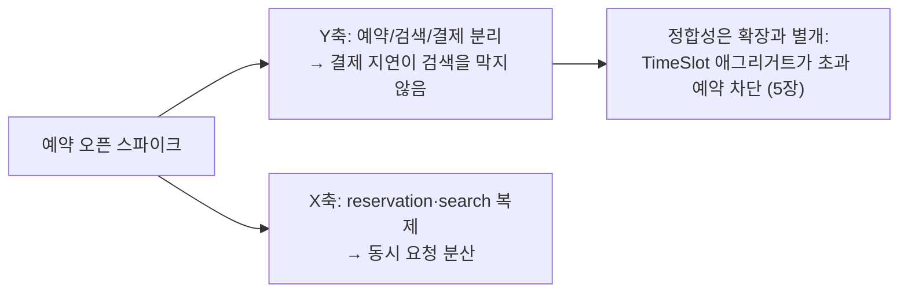

# 확장 큐브 분석 (1장 1.4.1)

《The Art of Scalability》의 3차원 확장 모델을 DibsTable에 대입한다.
핵심 트래픽 시나리오: **인기 식당 예약 오픈 순간, 특정 식당·특정 슬롯에 동시 예약이 폭주한다.**

| 축 | 정의 | DibsTable 적용 | 실현 시점 |
|---|---|---|---|
| **Y축** — 기능 분해 | 기능별 서비스 분리. 복잡도를 해결하는 유일한 축 | 예약·식당·결제·검색·웨이팅·게이트웨이로 분해. **이 프로젝트의 본체** | 2장~ |
| **X축** — 수평 복제 | 동일 인스턴스 N개 + 부하 분산 | 읽기 트래픽이 몰리는 search-service, 오픈런이 몰리는 reservation-service를 다중 인스턴스로 | 12장 (컨테이너 replicas) |
| **Z축** — 데이터 분할 | 요청 속성별 라우팅(샤딩) | **미적용.** 데이터 규모가 학습 범위를 넘어섬 | 회고로만 기록 |

## Z축 회고 메모

실서비스라면 `restaurantId` 해시로 예약 데이터를 샤딩할 수 있다(같은 식당의 예약이 같은 샤드에 모여 정원 검증이 로컬에서 완결). 3장의 Kafka 파티션 키(`reservationId`/`restaurantId`) 선택이 사실상 메시징 계층의 Z축 적용이라는 점을 해당 장에서 연결해 학습한다.

## 확장이 해결하지 않는 것

X·Z축은 처리량을 늘릴 뿐 **좌석 초과 예약 방지(정합성)는 해결하지 못한다**. 인스턴스가 몇 개든 `TimeSlot`의 정원 불변 값은 애그리거트 경계 + 낙관적 잠금(5장)과 사가의 시맨틱 락(4장)이 지킨다. "확장 문제"와 "동시성 문제"를 혼동하지 않는 것이 이 문서의 결론이다.
