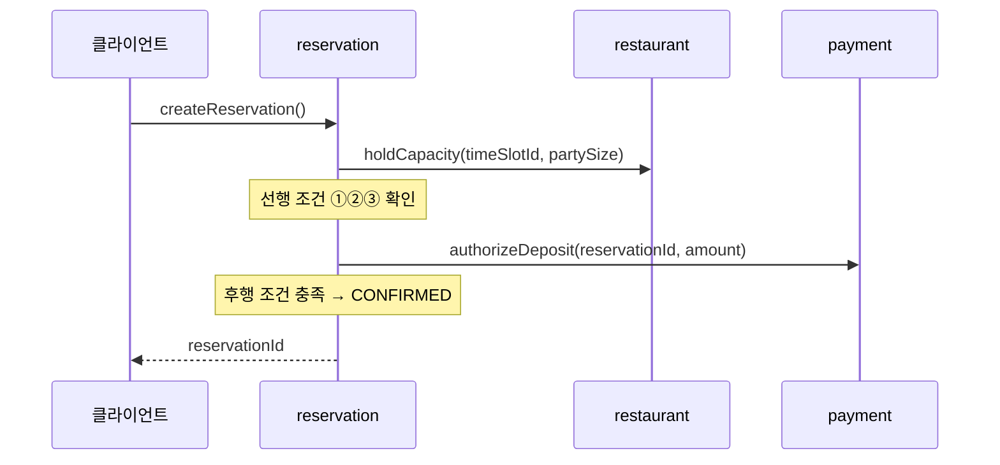
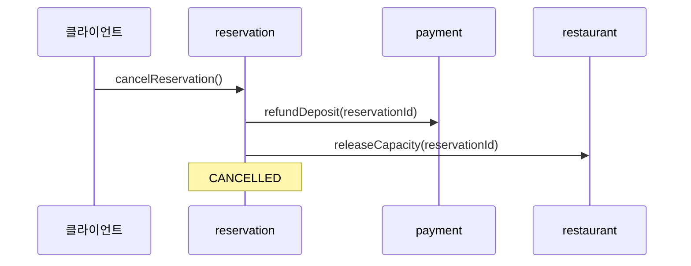

# 시스템 작업 (System Operations)

《마이크로서비스 패턴》 2.2절 3단계 프로세스 중 **1단계(시스템 작업 식별)**와 **3단계(API·협동 정의)**의 결과다.
2단계(서비스 식별)의 결정과 근거는 [ADR-004](../adr/ADR-004-service-boundaries.md)에 있다.

> **시스템 작업**이란 애플리케이션이 처리할 요청을 REST·메시징 같은 IPC 기술과 **무관하게 추상화**한 것이다.
> 이 문서에는 프로토콜·엔드포인트·메시지 포맷이 등장하지 않는다 — 그건 3장의 몫이다.

고수준 도메인 모델은 [requirements.md 5절 공용 언어](../requirements.md)로 갈음한다.

## 1. 커맨드 (Commands)

| 작업 | 액터 | 설명 | 배정 서비스 | UC |
|---|---|---|---|---|
| `createRestaurant()` | 사장님 | 식당 등록 | restaurant | UC-6 |
| `openTimeSlot()` | 사장님 | 날짜·시간대·정원 오픈 | restaurant | UC-6 |
| **`createReservation()`** | 고객 | **예약 생성** — 슬롯 선점 + 예약금 결제 | reservation | UC-3 |
| **`cancelReservation()`** | 고객 | **예약 취소** — 정원 반환 + 환불 | reservation | UC-4 |
| `acceptReservation()` | 사장님 | 예약 접수 확인 | reservation | UC-7 |
| `rejectReservation()` | 사장님 | 예약 거절 | reservation | UC-7 |
| `markNoShow()` | 사장님 | 노쇼 표시 | reservation | UC-7 |

## 2. 쿼리 (Queries)

| 작업 | 액터 | 배정 서비스 | UC |
|---|---|---|---|
| `findAvailableTimeSlots(restaurantId, date)` | 고객 | restaurant | UC-2 |
| `findRestaurants(지역, 업종, 정렬)` | 고객 | restaurant **(잠정)** → 7장 search-service | UC-1 |
| `findMyReservations(customerId)` | 고객 | reservation **(잠정)** → 7장 CQRS 뷰 | UC-5 |

> **잠정 배정의 의미** (책 p.101): 쿼리 작업은 데이터를 소유한 서비스가 아니라 **API 게이트웨이나 전용 쿼리 서비스에 배정될 수 있다.**
> `findRestaurants()`는 인기순 정렬이 예약 데이터에 의존하고, `findMyReservations()`는 예약·식당·결제를 조인해야 해서 두 작업 모두 단일 서비스로 답할 수 없다. 7장 CQRS에서 재배정한다.

## 3. 핵심 커맨드 명세 — 선행/후행 조건

사용자 시나리오의 Given/Then이 그대로 반영된다 (책 p.86). **4장 사가 설계의 직접 입력**이다.

### `createReservation(customerId, timeSlotId, partySize)`

| | 조건 |
|---|---|
| **선행** | ① 타임슬롯이 존재하고 예약 오픈 상태<br>② **잔여 정원 ≥ partySize**<br>③ 현재 시각이 슬롯의 예약 마감 시각 이전<br>④ 예약금 결제 수단이 유효 |
| **후행** | ① 타임슬롯 정원이 partySize만큼 차감됨<br>② 예약금이 승인됨<br>③ 예약이 CONFIRMED 상태로 존재 |

선행 조건 ②가 이 프로젝트의 **최우선 불변 값**(좌석 초과 예약 0건)이다. 조건 검사와 정원 차감 사이에 다른 예약이 끼어들 수 있다는 점이 5장 애그리거트·낙관적 잠금의 과제가 된다.

### `cancelReservation(reservationId)`

| | 조건 |
|---|---|
| **선행** | ① 예약이 CONFIRMED 상태<br>② 현재 시각이 취소 가능 기한(방문일 1일 전) 이전 |
| **후행** | ① 예약이 CANCELLED 상태<br>② 타임슬롯 정원이 반환됨<br>③ 예약금이 전액 환불됨 |

> **단순화**: 취소 기한이 지나면 취소 자체를 거부한다. 현실의 "취소는 되되 환불 없음"은 부분 환불 정책이 필요해 학습 가치 대비 복잡도가 커서 제외했다.

## 4. 발행 이벤트

서비스 API는 커맨드·쿼리·**이벤트** 3요소로 구성된다 (책 p.76). 컨슈머가 명확한 것만 정의한다.

| 이벤트 | 발행 | 발생 시점 | 예상 컨슈머 |
|---|---|---|---|
| `ReservationCreated` | reservation | 예약이 결제 대기 상태로 생성 | (4장 사가) |
| `ReservationConfirmed` | reservation | 결제 승인 후 확정 | 7장 인기 랭킹 뷰 |
| `ReservationCancelled` | reservation | 취소 확정 | 7장 인기 랭킹 뷰 |
| `DepositAuthorized` | payment | 예약금 승인 성공 | 4장 사가 |
| `DepositRefunded` | payment | 환불 완료 | 4장 사가 |
| `RestaurantRegistered` | restaurant | 식당 등록 | 7장 검색 뷰 |

정원 변화(`CapacityHeld` 등)는 사가 응답으로 처리되므로 도메인 이벤트로 발행하지 않는다. 필요해지면 그때 추가한다.

## 5. 협동 스케치 (3단계)

대부분의 시스템 작업은 여러 서비스에 걸친다. **아직 IPC 기술을 정하지 않은 추상 스케치**이며, 실패 처리·보상·순서 보장은 4장 사가의 몫이다.

### `createReservation()`



### `cancelReservation()`



## 6. 가용성 계산 — 3장으로 넘어가는 이유

위 협동을 **동기 호출 체인**으로 구현하면 가용성은 관여 서비스 가용성의 **곱**이 된다 (책 p.147).

```
서비스 개별 가용성 99.5% × 3개 = 0.995³ ≈ 98.51%
→ 월 다운타임 약 10.7시간 (단일 서비스라면 3.6시간)
```

[requirements.md](../requirements.md)의 품질 요구 "가용성 — 동기 호출 체인 최소화"가 여기서 구체화된다. 3장에서 비동기 메시징으로 전환하는 근거이며, 특히 결제 승인은 외부 PG에 의존해 실질 가용성이 더 낮다.

---

*다음: [ADR-004 서비스 경계](../adr/ADR-004-service-boundaries.md)*
